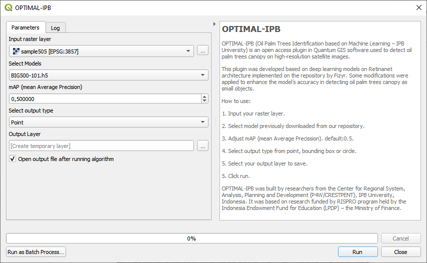

# OPTIMAL-IPB

OPTIMAL-IPB (Oil Palm Trees Identification based on Machine Learning – IPB University) is an open access plugin in Quantum GIS software used to detect oil palm trees canopy on high-resolution satellite images. This plugin was developed based on deep learning models on Retinanet architecture implemented on the repository by Fizyr. Some modifications were applied to enhance the model’s accuracy in detecting oil palm trees canopy as small objects. OPTIMAL_IPB was built by researchers from the [Center for Regional System, Analysis, Planning and Development (P4W/CRESTPENT)](https://p4w.ipb.ac.id), IPB University, Indonesia. It was based on research funded by RISPRO program held by the [Indonesia Endowment Fund for Education (LPDP)](https://lpdp.kemenkeu.go.id) – the Ministry of Finance.

## Installation Steps

:warning: This plugin was developed in python 3.7 environment contained in QGIS version 3.10 A Coruña, and works with keras version 2.4.3 and tensorflow version 2.3.0.

### 1. Package Required

Some packages need to be installed in the QGIS environment first. There are two ways to install packages in the QGIS environment.

#### - Package installation via python console in QGIS

Open python console in QGIS and run `import pip` then `pip.main(['install', '-q', '--disable-pip-version-check', 'scipy', 'cython', 'keras-resnet==0.2.0', 'opencv-python>=3.3.0', 'pillow', 'progressbar2', 'tensorflow>=2.3.0', 'keras>=2.4.3'])` to install all the prerequisites.

#### - Module installation via OSGeo4W Shell

Open OSGeo4W Shell then run this command `python3 -m pip install scipy cython keras-resnet==0.2.0 opencv-python>=3.3.0 pillow progressbar2 tensorflow>=2.3.0 keras>=2.4.3`

### 2. GPU Configuration (Optional)
This plugin is built using tensorflow as a machine learning framework. For faster process, it is highly recommended to use a GPU. You can find complete instructions for GPU Support through [this link](https://www.tensorflow.org/install/gpu#software_requirements).

For Windows user, we need to add the CUDA®, CUPTI, and cuDNN installation directories to the %PATH% environmental variable on QGIS. Click `Settings > Options`, on the System Tab choose `Environment` then check `Use custom variables (restart required - include separators)`.

Click Plus (+) button, then add configuration bellow:

- `Apply: Prepend`
- `Variable: PATH`
- `Value: C:\Program Files\NVIDIA GPU Computing Toolkit\CUDA\v10.1\bin;C:\Program Files\NVIDIA GPU Computing Toolkit\CUDA\v10.1\extras\CUPTI\lib64;C:\Program Files\NVIDIA GPU Computing Toolkit\CUDA\v10.1\include;`

### 3. Plugin Installation
There are two ways to install this plugin.
1. From official QGIS Plugin Repository - Use the QGIS Plugins menu to install the OPTIMAL-IPB Plugin (see [QGIS manual](http://docs.qgis.org/latest/en/docs/user_manual/plugins/plugins.html)).
2. From [Zipfile](https://github.com/p4wlppmipb/OPTIMAL-IPB/archive/master.zip) of this repository. Then follow this [instruction](http://docs.qgis.org/latest/en/docs/user_manual/plugins/plugins.html#the-install-from-zip-tab).

### 4. Pick a Model

There are three models that have been trained using Backbone Resnet101. You can download the three models in the table below:
| Satellite Imagery Paltform  | mAP@0.5 | Model (inference) |
| --------------------------- | ------- | -------------------- |
| Pleiades Satellite Imagery  | 0.903   | [Pleiades-Resnet101.h5](https://github.com/p4wlppmipb/OPTIMAL-IPB/releases/download/0.1/Pleiades-Resnet101.h5) |
| Geoeye Satellite Imagery    | 0.900   | [Geoeye-Resnet101.h5](https://github.com/p4wlppmipb/OPTIMAL-IPB/releases/download/0.1/Geoeye-Resnet101.h5)     |
| Google Satellite Imagery    | 0.925   | [Google-Resnet101.h5](https://github.com/p4wlppmipb/OPTIMAL-IPB/releases/download/0.1/Google-Resnet101.h5)     |

Copy all models you downloads to your plugin directory. Eg: `C:\Users\Username\AppData\Roaming\QGIS\QGIS3\profiles\default\python\plugins\optimal-ipb\models`.

## Usage

This plugin can be accessed under Plugins menu, then select `Calculate > OPTIMAL-IPB` or in the Processing Toolbox, then select `OPTIMAL-IPB > OPTIMAL-IPB` as shown in the image below:

Afterward you can input your raster layer and select your output layer to save, then click 'run':

## Sources

1) [fizyr/keras-retinanet](https://github.com/fizyr/keras-retinanet)
2) [Martin Zlocha](https://github.com/martinzlocha/anchor-optimization)
3) [(Faster) Non-Maximum Suppression in Python](https://pyimagesearch.com/2015/02/16/faster-non-maximum-suppression-python/) by Adrian Rosebrock
4) [Sliding Windows for Object Detection with Python and OpenCV](https://pyimagesearch.com/2015/03/23/sliding-windows-for-object-detection-with-python-and-opencv/) by Adrian Rosebrock

## For developers

If you have any idea or trouble, please [post an Issue](https://github.com/p4wlppmipb/OPTIMAL-IPB/issues) first.

We very much welcome contributions from all developers out there. This project is a community-driven open-source tool - please help us to make it better.

## License

OPTIMAL-IPB is free software; you can redistribute it and/or modify it under the terms of the GNU General Public License as published by the Free Software Foundation; either version 3 of the License, or (at your option) any later version.

<em>Copyright © 2018-2022 Muhammad Nurdin, Didit Okta Pribadi, La Ode Syamsul Iman. @ [P4W/CRESTPENT](https://p4w.ipb.ac.id)-LPPM, IPB University</em>
